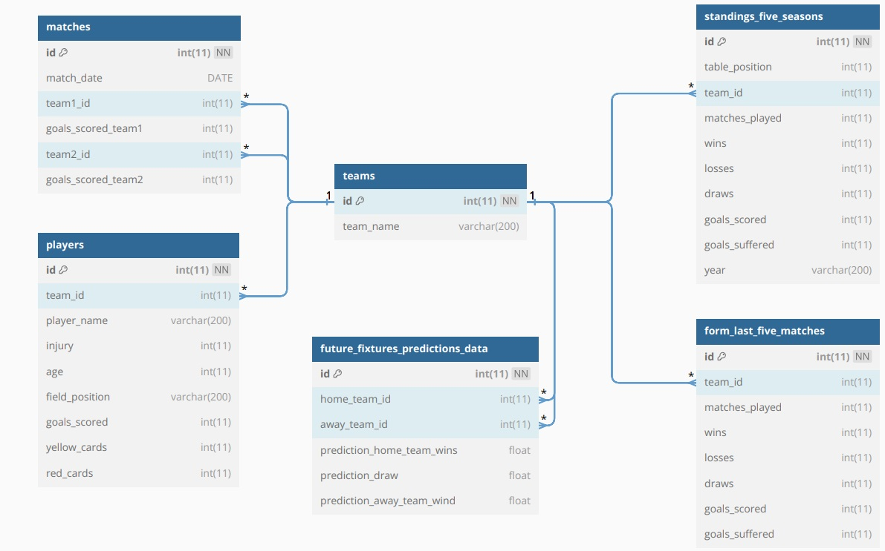

# DMFlashScore

DMFlashScore is a Python based program dealing with graphical presentation of statistical data extracted from Flashscore website https://www.flashscore.com/
It scrapes the information for the Premier League such as:
- premier league teams
- standings information of the 5 previous seasons
- matches and goals between teams
- form of last 5 matches
- players of each team and their stats

## Installation

Get the code on https://github.com/aroguerra/DMFlashscore/tree/master
Either download the zip folder and extract it or clone the repository into your computer

## Usage

The DMFlashScore has a CLI based user interface.
By running the command
```bash
./DMflashscore.py *command*
```
 command           | action |
|-------------------|-------------------------------|
| -h, --help        | show this help message and exit |
| -all, -a          | fetch all scraped data        |
| -seasons, -s      | fetch last 5 seasons data     |
| -matches, -m      | fetch all scraped data        |
| -players, -p      | fetch players data            |
| -form, -f         | fetch form last 5 matches data |
| -teams, -t        | fetch teams data              |
| -predictions, -pd | fetch predictions for future fixtures|

This comand will activate scraping based data mining proces which at its end a dashboard, visualizing stastical data, will be presented.


The scraped data will also be saved into a Database with the following tables:

| Tables_in_flashscore   |
|------------------------|
| form_last_five_matches |
| matches                |
| players                |
| standings_five_seasons |
| teams                  |

The data base ERD design schema is presented in the folowing figure:



## Description

DMFlashScore is a [Selenium](https://pypi.org/project/selenium/) based data mining application, which scrapes statistical data from the Flashscore website and Sportmonks API and visualy presents it to the potencial gambller. While the selenium Python module is used in this application to access the Flashscore webpages and find and fetch the relevant data objects, the requests Python module is used to access the Spotmonks API. The presntation of the data is done by a ReDash created dashbourd, and the user interface is CLI based.